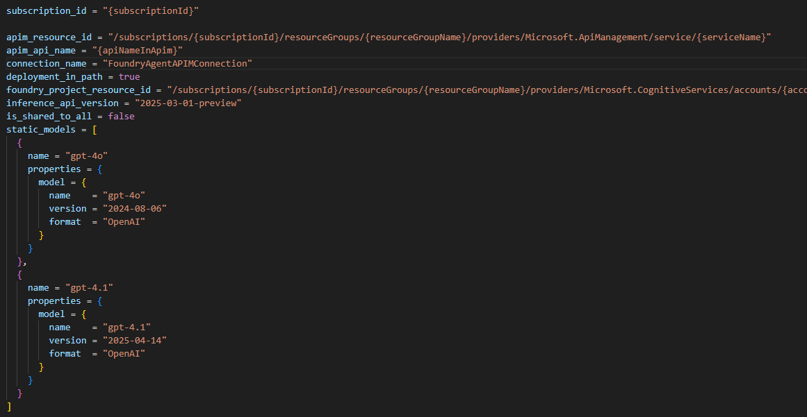

# Microsoft Foundry Agent APIM Connection

## Introduction

This capability enables organizations to maintain control over their model endpoints. Keep your model endpoints secure behind your existing APIM Gateway by applying security policies. It is also useful when Azure OpenAI PTU models are shared across multiple subscriptions.

## Setup Steps

### 1. Create a Foundry API in APIM

Create a Foundry API in APIM and keep a note of the API Name using the [Azure AI Foundry API documentation](https://learn.microsoft.com/en-us/azure/api-management/azure-ai-foundry-api).

 

### 2a. Deploy Using Bicep

Clone the repository: https://github.com/azure-ai-foundry/foundry-samples/tree/main/infrastructure/infrastructure-setup-bicep/01-connections/apim
The repository only shows how to create Foundry Project APIM connection with static models, for other types please use appropriate json file.

Copy `samples/parameters-static-models.json` and edit the parameters:

- **projectResourceId**: Enter Foundry Project Resource Id

  

- **apimResourceId**: Enter APIM Resource Id

  

- **apiName**: Enter Foundry API name from Step 1

- **connectionName**: Give connection name which will be created as connection in Foundry Project (e.g., `FoundryAgentAPIMConnection`)

- Under "Static" model sections, list the models in Foundry project and set format as "OpenAI" **(Use New Foundry View)**

  

  

Run in command line:

```bash
az deployment group create --resource-group [Resource Group] --template-file connection-apim.bicep --parameters @samples/parameters-static-models-foundry.json
```

### 2b. Deploy Using Terraform
The terraform configuration in this repository only shows how to create Foundry Project APIM connection with static models. You can extend it as per your requirements with reference to Bicep code https://github.com/azure-ai-foundry/foundry-samples/tree/main/infrastructure/infrastructure-setup-bicep/01-connections/apim

1. Navigate to the `terraform` directory:
   ```bash
   cd terraform
   ```
2. Create a `terraform.tfvars` file from the example:
   ```bash
   cp terraform.tfvars.example terraform.tfvars
   ```
3. Update the following variables in `terraform.tfvars`:
    - `subscription_id` (string): The subscription ID to deploy resources into which is the same subscription as Foundry Project.
    - `apim_resource_id` (string): The resource ID of the API Management service.
    - `apim_api_name` (string): The name of the API in API Management to connect to.
    - `connection_name` (string): The name of the Foundry Project APIM connection. If not provided, defaults to the API Management service name.
    - `deployment_in_path` (bool): Whether deployment name is in URL path vs body. Defaults to true which means deployment name is included in the URL path.
    - `foundry_project_resource_id` (string): The resource ID of the Foundry Project.
    - `inference_api_version` (string): "API version for inference calls (chat completions, embeddings). Defaults to '2025-03-01-preview'."
    - `is_shared_to_all` (bool): "Share connection to all project users. Defaults to false."
    - `static_models` (list): List of static models to configure in the APIM connection. Refer to terraform variables.tf and example tfvars for format.
  
4. Initialize Terraform:
   ```bash
   terraform init
   ```
5. Review the Terraform execution plan:
   ```bash
   terraform plan
   ```
6. Apply the Terraform configuration:
   ```bash
   terraform apply
   ```

### 3. Verify APIM Connection

Verify if APIM connection is created in Foundry Project Resource (New Foundry > Operate > Admin > All Projects > Select Project > Connected Resources)


### 4. Test Using Sample Agents SDK

Test using Sample Agents SDK: `test-agents-apim.py`. Set environment variable which refers to model using APIM connection name in Foundry Project:

```bash
AZURE_AI_FOUNDRY_MODEL_DEPLOYMENT_NAME="FoundryAgentAPIMConnection/gpt-4.1"
```

## References

- [Bring your own AI gateway to Azure AI Agent Service (preview) - Microsoft Foundry | Microsoft Learn](https://learn.microsoft.com/en-us/azure/ai-foundry/agents/how-to/ai-gateway?view=foundry)
- [foundry-samples/infrastructure/infrastructure-setup-bicep/01-connections/apim](https://github.com/azure-ai-foundry/foundry-samples/tree/main/infrastructure/infrastructure-setup-bicep/01-connections/apim)

## Disclaimer

This Prototype/Proof of Concept (POC) sample template code can be utilized by customers and adapted according to their specific use cases and testing requirements. Microsoft or the author does not hold responsibility for the maintenance of customer code, production issues, or security vulnerabilities.


