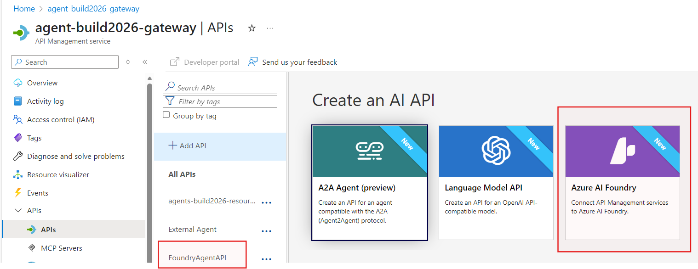
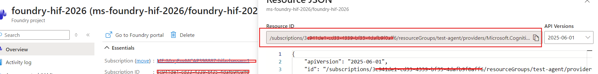
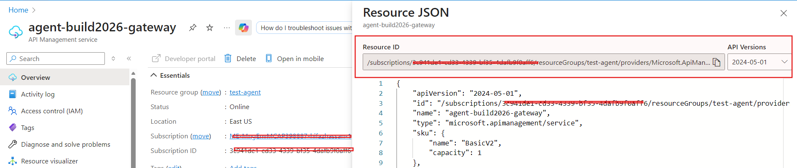
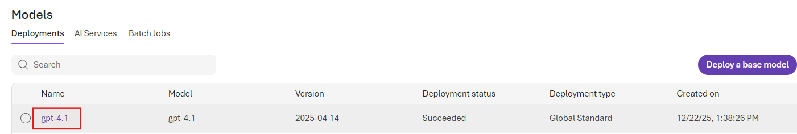
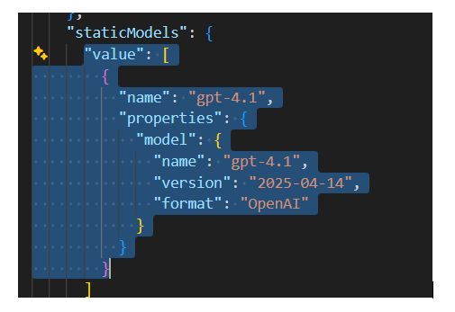
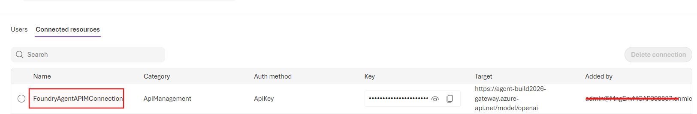

# Microsoft Foundry Agent APIM Connection

## Introduction

This capability enables organizations to maintain control over their model endpoints. Keep your model endpoints secure behind your existing APIM Gateway by applying security policies. It is also useful when Azure OpenAI PTU models are shared across multiple subscriptions.

## Setup Steps

### 1. Create a Foundry API in APIM

Create a Foundry API in APIM and keep a note of the API Name using the [Azure AI Foundry API documentation](https://learn.microsoft.com/en-us/azure/api-management/azure-ai-foundry-api).

 

### 2a. Deploy Using Bicep

Clone the repository: https://github.com/azure-ai-foundry/foundry-samples/tree/main/infrastructure/infrastructure-setup-bicep/01-connections/apim

Copy `samples/parameters-static-models.json` and edit the parameters:

- **projectResourceId**: Enter Foundry Project Resource Id

  

- **apimResourceId**: Enter APIM Resource Id

  

- **apiName**: Enter Foundry API name from Step 1

- **connectionName**: Give connection name which will be created as connection in Foundry Project (e.g., `FoundryAgentAPIMConnection`)

- Under "Static" model sections, list the models in Foundry project and set format as "OpenAI" **(Use New Foundry View)**

  

  

Run in command line:

```bash
az deployment group create --resource-group [Resource Group] --template-file connection-apim.bicep --parameters @samples/parameters-static-models-foundry.json
```

### 2b. Deploy Using Terraform

[To be included]

### 3. Verify APIM Connection

Verify if APIM connection is created in Foundry Project Resource (New Foundry > Operate > Admin > All Projects > Select Project > Connected Resources)



### 4. Test Using Sample Agents SDK

Test using Sample Agents SDK: `test-agents-apim.py`. Set environment variable which refers to model using APIM connection name in Foundry Project:

```bash
AZURE_AI_FOUNDRY_MODEL_DEPLOYMENT_NAME="FoundryAgentAPIMConnection/gpt-4.1"
```

## References

- [Bring your own AI gateway to Azure AI Agent Service (preview) - Microsoft Foundry | Microsoft Learn](https://learn.microsoft.com/en-us/azure/ai-foundry/agents/how-to/ai-gateway?view=foundry)
- [foundry-samples/infrastructure/infrastructure-setup-bicep/01-connections/apim](https://github.com/azure-ai-foundry/foundry-samples/tree/main/infrastructure/infrastructure-setup-bicep/01-connections/apim)

## Disclaimer

This Prototype/Proof of Concept (POC) sample template code can be utilized by customers and adapted according to their specific use cases and testing requirements. Microsoft or the author does not hold responsibility for the maintenance of customer code, production issues, or security vulnerabilities.


